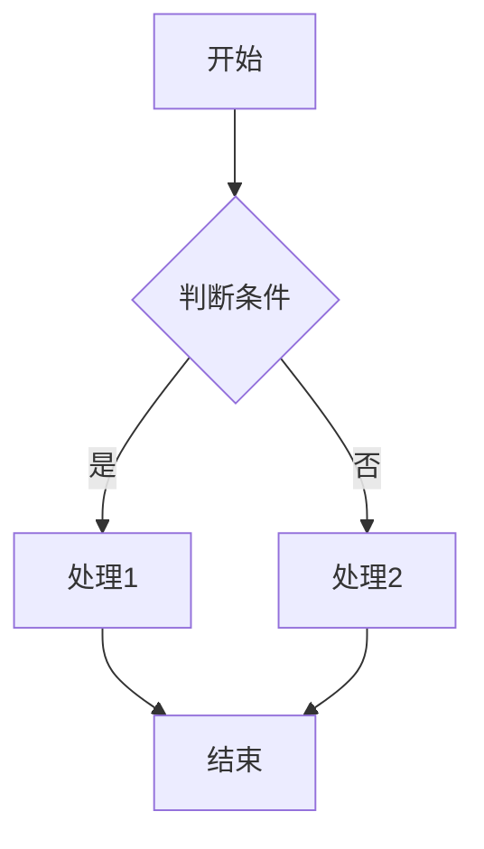
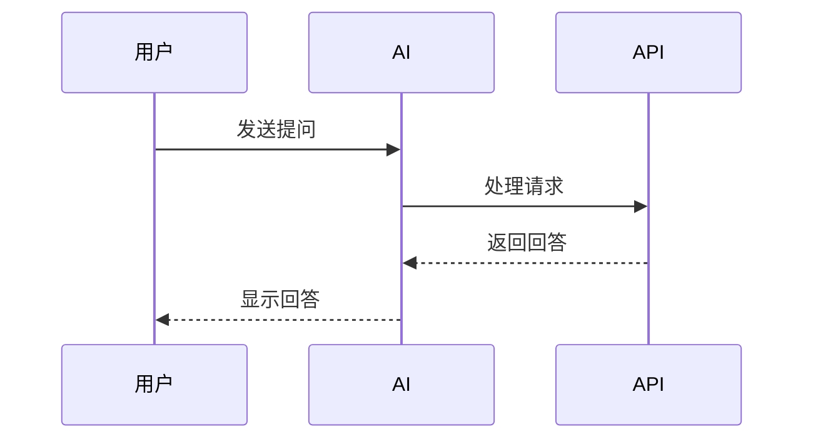
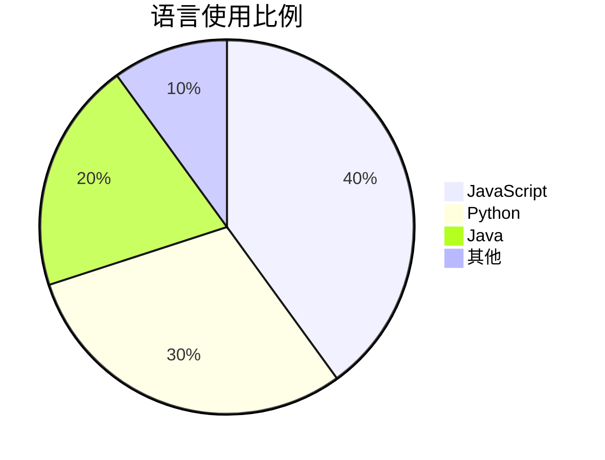

# Vue AI Chat 应用

基于Vue.js构建的现代化AI聊天应用，提供流畅的用户体验与丰富的功能。

## 核心功能

- **流式输出** - 实时展示AI响应，支持打字机效果
- **Markdown渲染** - 全面支持Markdown格式，包括代码块、表格与数学公式
- **KaTeX支持** - 优雅渲染数学公式
- **Mermaid图表** - 支持生成各类图表
- **深色/浅色模式** - 适应不同环境和用户偏好
- **移动端适配** - 响应式设计，完美支持各种设备
- **历史会话管理** - 保存、读取和管理聊天历史
- **多模型支持** - 集成多种AI模型，可自由切换
- **API配置** - 灵活配置API密钥和端点
- **代码高亮** - 支持多种语言的代码高亮显示

## 最新优化

### UI/UX 改进

1. **消息气泡增强**
   - 添加细微阴影效果，提升层次感
   - 优化圆角设计，更符合聊天应用直觉
   - 改进暗色模式下的消息气泡样式

2. **加载状态指示器**
   - 添加旋转动画在AI消息加载时显示
   - 当API返回第一个内容片段时自动消失
   - 视觉反馈帮助用户了解系统状态

3. **滚动体验优化**
   - 扩大自动滚动阈值至250px，实现更智能的内容跟随
   - 添加平滑滚动过渡效果 
   - 滚动按钮的动画与交互优化

4. **代码块改进**
   - 增加悬停效果和微小上浮动画
   - 优化复制按钮的交互体验
   - 为暗色模式设计特定样式

5. **表格展示优化**
   - 重设表格样式，增强可读性
   - 解决表格过宽导致内容截断问题
   - 改进响应式表现

6. **思考内容区块**
   - 视觉设计更加优雅
   - 添加展开/收起交互
   - 增强暗色模式适配

### 性能优化

1. **渲染效率**
   - 仅对最新AI消息应用动画效果
   - 历史消息立即完整显示，无动画
   - 针对不同状态消息精细化CSS管理

2. **资源加载**
   - 按需加载样式和组件
   - 适当的懒加载策略
   - 优化动画性能

3. **内存管理**
   - 清理定时器和事件监听
   - 通过适当缓存减少不必要的重复计算

## 技术栈

- **前端框架**: Vue 3
- **状态管理**: Pinia
- **UI组件**: Element Plus
- **样式处理**: SCSS
- **Markdown解析**: markdown-it
- **数学公式**: KaTeX
- **图表支持**: Mermaid.js
- **代码高亮**: highlight.js

## 关键技术细节

### 消息流式处理

采用流式处理方式接收API响应，结合Web Streams API，实现实时消息展示，具有以下优势：

- 减少首字符显示时间 (TTFB)
- 用户可以在完整响应生成前开始阅读
- 提供中断生成的能力

### 打字机效果实现

```javascript
// 处理AI消息的打字效果
const startTypingEffect = (content) => {
  // 仅对最新的、未完成的AI消息执行打字效果
  if (!props.isLatestMessage || messageCompleted.value) {
    displayContent.value = content;
    return content;
  }
  
  // 重置打字状态
  originalContent.value = content;
  displayContent.value = '';
  typingIndex.value = 0;
  isTyping.value = true;
  
  // 启动打字动画
  typingTimer.value = setInterval(() => {
    if (typingIndex.value < content.length) {
      displayContent.value += content[typingIndex.value];
      typingIndex.value++;
    } else {
      // 完成打字效果
      clearInterval(typingTimer.value);
      isTyping.value = false;
      displayContent.value = content;
      messageCompleted.value = true;
    }
  }, typingSpeed.value);
  
  return displayContent.value;
};
```

### 加载指示器设计

服务器响应前显示的加载指示器使用SVG圆圈动画实现，提供平滑的视觉反馈：

```scss
.loading-spinner {
  display: inline-flex;
  align-items: center;
  justify-content: center;
  
  .spinner {
    animation: rotate 2s linear infinite;
    width: 20px;
    height: 20px;
    
    .path {
      stroke: #4284f5;
      stroke-linecap: round;
      animation: dash 1.5s ease-in-out infinite;
    }
  }
}

@keyframes rotate {
  100% {
    transform: rotate(360deg);
  }
}

@keyframes dash {
  0% {
    stroke-dasharray: 1, 150;
    stroke-dashoffset: 0;
  }
  50% {
    stroke-dasharray: 90, 150;
    stroke-dashoffset: -35;
  }
  100% {
    stroke-dasharray: 90, 150;
    stroke-dashoffset: -124;
  }
}
```

### 自定义滚动条

为提升用户体验，应用使用自定义滚动条样式：

```scss
&::-webkit-scrollbar {
  width: 6px;
}

&::-webkit-scrollbar-track {
  background: transparent;
}

&::-webkit-scrollbar-thumb {
  background-color: rgba(0,0,0,0.1);
  border-radius: 3px;
}

scrollbar-width: thin; // 标准CSS属性，只支持thin/auto/none
```

### 代码块处理

代码块处理采用特殊策略，确保在打字效果期间整个代码块完整显示：

```javascript
// 对预处理内容进行标记，确保块级元素立即完整显示
const codeBlockRegex = /```[\s\S]*?```/g;
const mathBlockRegex = /\$\$([\s\S]*?)\$\$/g;

// 如果当前打字位置已经开始显示块级元素，则显示完整块
for (const block of blocks) {
  if (block.start < typingIndex.value) {
    // 替换为完整块
    preprocessedContent = preprocessedContent.substring(0, block.start) + 
                          block.content + 
                          preprocessedContent.substring(partEndIndex);
  }
}
```

## Mermaid图表支持

本应用现在支持Mermaid图表语法。只需在代码块中使用`mermaid`语言标识即可：



还支持其他类型的图表：





## 开发与贡献

1. 克隆仓库
```bash
   git clone https://github.com/your-username/vue-ai-chat.git
```

2. 安装依赖
```bash
   cd vue-ai-chat
npm install
```

3. 启动开发服务器
```bash
npm run dev
```

4. 构建生产版本
```bash
npm run build
```

## 环境变量

应用支持通过环境变量或UI配置API密钥和端点：

```
VITE_OPENAI_API_KEY=your_api_key
VITE_OPENAI_API_ENDPOINT=https://api.openai.com/v1/chat/completions
```

## 已知问题和解决方案

### CSS滚动条宽度限制
`scrollbar-width: thin` 不能设置为具体像素值（如1px或1em），因为这是CSS规范中的枚举属性，只接受`thin`、`auto`或`none`。如需精确控制滚动条宽度，必须使用WebKit私有属性`::-webkit-scrollbar`，但这会限制浏览器兼容性。

### 移动端特定优化
在移动设备上，我们使用更紧凑的UI布局并简化某些交互。字体选择上也特别注重移动设备的可读性，使用了更适合小屏幕的字体设置：

```scss
@media (max-width: 768px) {
  font-family: "Microsoft YaHei", "PingFang SC", "Heiti SC", "Noto Sans SC", sans-serif;
  font-weight: 400;
  -webkit-font-smoothing: antialiased;
  -moz-osx-font-smoothing: grayscale;
  letter-spacing: 0.015em;
}
```

## 许可证

[MIT](LICENSE)

